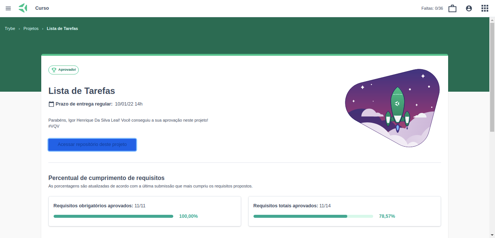

Esse projeto foi desenvolvido utilizando HTML, CSS e JavaScript. Feito ao final do Bloco 05 do Módulo de Fundamentos do Desenvolvimento Web da [Trybe](https://www.betrybe.com/).

Requisitos obrigatórios:

- *1 - Adicone à sua lista o título "Minha Lista de Tarefas" em uma tag;*

- *2 - Adicione abaixo do título um pequeno e discreto parágrafo com id="funcionamento" e com o texto "Clique duas vezes em um item para marcá-lo como completo"*

- *3 - Adicione um input com o id="texto-tarefa" onde o usuário poderá digitar o nome do item que deseja adicionar à lista;*

- *4 - Adicione uma lista ordenada de tarefas com o id="lista-tarefas";*

- *5 - Adicione um botão com id="criar-tarefa" e, ao clicar nesse botão, um novo item deverá ser criado ao final da lista e o texto do input deve ser limpo;*

- *6 - Ordene os itens da lista de tarefas por ordem de criação;*

- *7 - Clicar em um item da lista deve alterar a cor de fundo do item para cinza rgb(128,128,128);*

- *8 - Não deve ser possível selecionar mais de um elemento da lista ao mesmo tempo;*

- *9 - Clicar duas vezes em um item, faz com que ele seja riscado, indicando que foi completo. Deve ser possível desfazer essa ação clicando novamente duas vezes no item;*

- *10 - Adicione um botão com id="apaga-tudo" que quando clicado deve apagar todos os itens da lista;*

- *11 - Adicione um botão com id="remover-finalizados" que quando clicado remove somente os elementos finalizados da sua lista;*

Requisitos bônus:

- *12 - Adicione um botão com id="salvar-tarefas" que salve o conteúdo da lista. Se você fechar e reabrir a página, a lista deve continuar no estado em que estava;*

- *13 - Adicione dois botões, um com id="mover-cima" e outro com id="mover-baixo", que permitam mover o item selecionado para cima ou para baixo na lista de tarefas;*

- *14 - Adicione um botão com id="remover-selecionado" que, quando clicado, remove o item selecionado;*