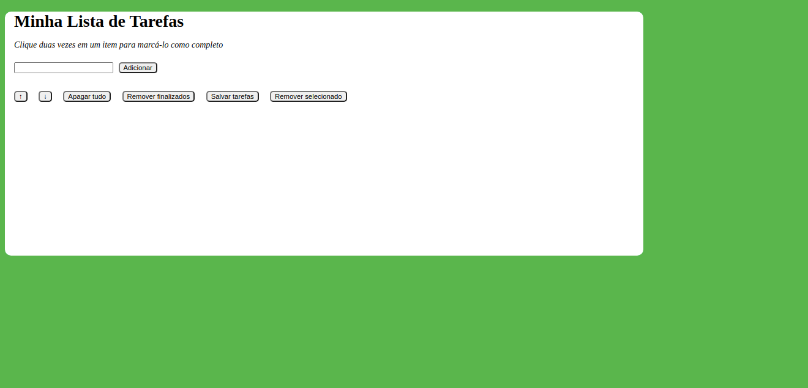
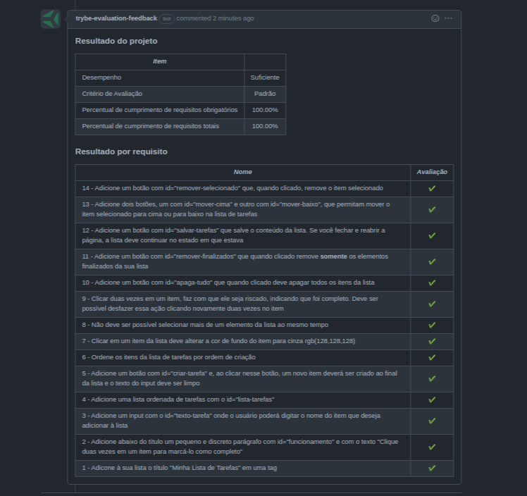

## Projeto To Do List

Esse projeto foi desenvolvido utilizando HTML, CSS e JavaScript. Feito ao final do Bloco 05 do Módulo de Fundamentos do Desenvolvimento Web da [Trybe](https://www.betrybe.com/).

[Clique aqui](https://igorhleal.github.io/project-to-do-list/) e acesse a aplicação em seu navegador.

O objetivo deste projeto é desenvolver uma lista de tarefas em que o usuário possa adicionar e remover uqalquer tarefa!
Essas tarefas são adicionadas em uma lista logo abaixo do input onde a tarefa é digitada.

Concluí todos os 14 requisitos totais, atingindo 100% de aprovação.

### Imagem do Resultado Final

---

### Imagem do desempenho e nota obtida

